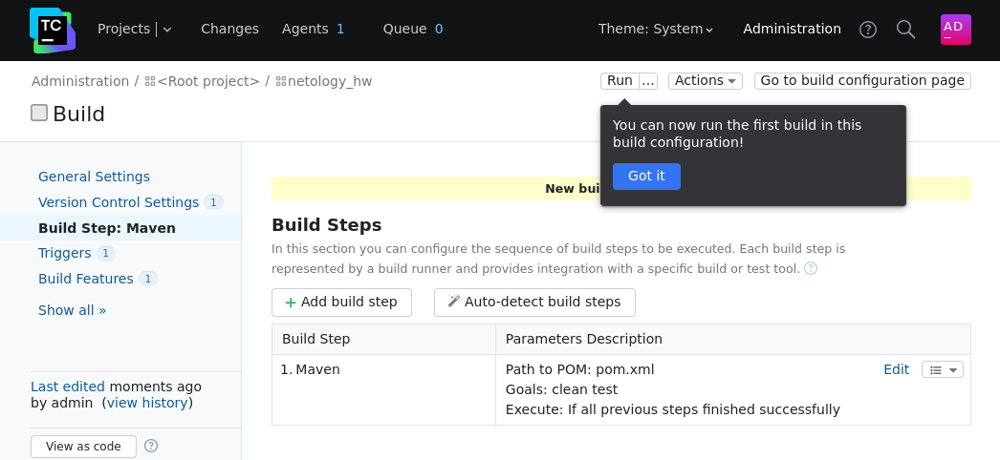
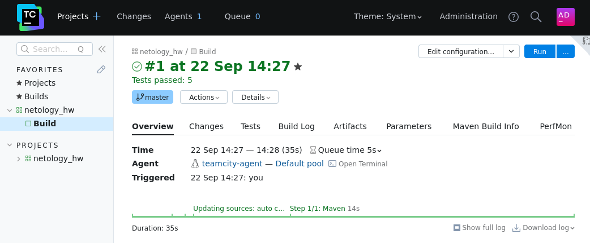
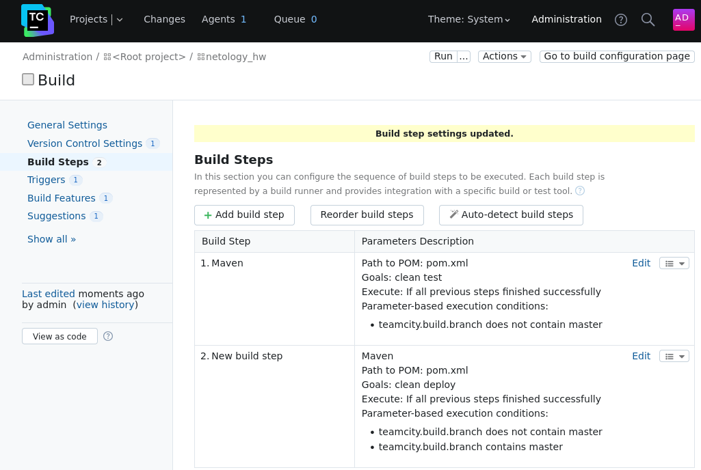
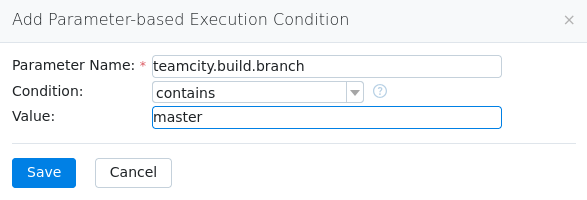
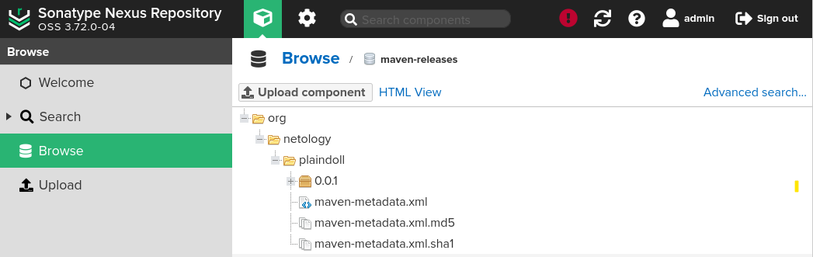
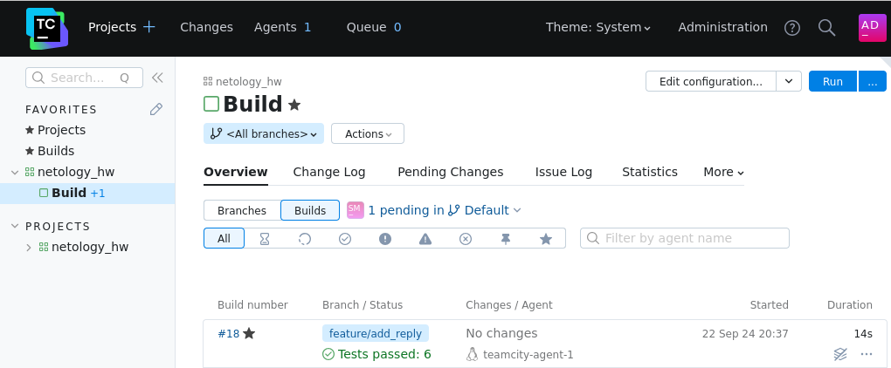
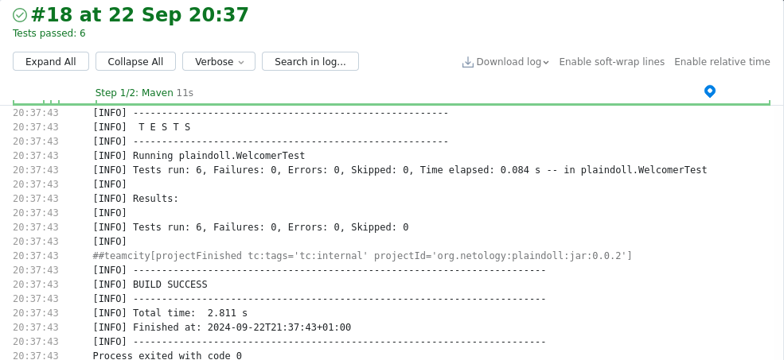
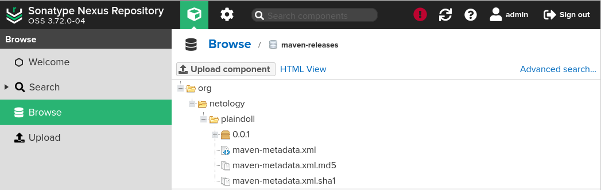

# Домашнее задание к занятию 11 «Teamcity»- Михалёв Сергей

## Подготовка к выполнению

1. В Yandex Cloud создайте новый инстанс (4CPU4RAM) на основе образа `jetbrains/teamcity-server`.
2. Дождитесь запуска teamcity, выполните первоначальную настройку.
3. Создайте ещё один инстанс (2CPU4RAM) на основе образа `jetbrains/teamcity-agent`. Пропишите к нему переменную окружения `SERVER_URL: "http://<teamcity_url>:8111"`.
4. Авторизуйте агент.
5. Сделайте fork [репозитория](https://github.com/aragastmatb/example-teamcity).
6. Создайте VM (2CPU4RAM) и запустите [playbook](./infrastructure).

## Основная часть

1. Создайте новый проект в teamcity на основе fork.
2. Сделайте autodetect конфигурации.
3. Сохраните необходимые шаги, запустите первую сборку master.
4. Поменяйте условия сборки: если сборка по ветке `master`, то должен происходит `mvn clean deploy`, иначе `mvn clean test`.
5. Для deploy будет необходимо загрузить [settings.xml](./teamcity/settings.xml) в набор конфигураций maven у teamcity, предварительно записав туда креды для подключения к nexus.
6. В pom.xml необходимо поменять ссылки на репозиторий и nexus.
7. Запустите сборку по master, убедитесь, что всё прошло успешно и артефакт появился в nexus.
8. Мигрируйте `build configuration` в репозиторий.
9. Создайте отдельную ветку `feature/add_reply` в репозитории.
10. Напишите новый метод для класса Welcomer: метод должен возвращать произвольную реплику, содержащую слово `hunter`.
11. Дополните тест для нового метода на поиск слова `hunter` в новой реплике.
12. Сделайте push всех изменений в новую ветку репозитория.
13. Убедитесь, что сборка самостоятельно запустилась, тесты прошли успешно.
14. Внесите изменения из произвольной ветки `feature/add_reply` в `master` через `Merge`.
15. Убедитесь, что нет собранного артефакта в сборке по ветке `master`.
16. Настройте конфигурацию так, чтобы она собирала `.jar` в артефакты сборки.
17. Проведите повторную сборку мастера, убедитесь, что сбора прошла успешно и артефакты собраны.
18. Проверьте, что конфигурация в репозитории содержит все настройки конфигурации из teamcity.
19. В ответе пришлите ссылку на репозиторий.

---

### Решение

1. Сделайл autodetect конфигурации. с ролью.</br>
   </br>
2.Сохранил необходимые шаги, запустил первую сборку master.</br>
   </br>
3. Поменял условия сборки: если сборка по ветке `master`, то должен происходит `mvn clean deploy`, иначе `mvn clean test`.</br>
   </br>
   </br>
4. Загрузил [`settings.xml`](https://github.com/netology-code/mnt-homeworks/blob/MNT-video/09-ci-05-teamcity/teamcity/settings.xml) в набор конфигураций maven у teamcity, предварительно записав туда креды для подключения к nexus. В `pom.xml` поменял ссылки на репозиторий и nexus.Запустил сборку по master, убедился, что всё прошло успешно и артефакт появился в nexus.</br>
   </br>
5. Согласно рекомендациям из [статьи](https://www.jetbrains.com/help/teamcity/project-export.html) экспортировал [настройки проекта](https://github.com/sergeMMikh/example-teamcity_4_hw/blob/master/TeamCity__Root_20240922_180838.zip) в репозиторий. Так же перенёс файл [.teamcity](https://github.com/sergeMMikh/example-teamcity_4_hw/tree/master/.teamcity).
6. Добавил метод класса `Welcomer`
```
public String sayCasador() {
   return "Casador means hunter.";
}
```
7. Дополнил список тестов для этого класса
```
@Test
public void welcomerSayCasador() {
   assertThat(welcomer.sayCasador(), containsString("hunter"));
}
```
8. Сделал push всех изменений в новую ветку репозитория. Убедитесь, что сборка самостоятельно запустилась, тесты прошли успешно.</br>
   </br>
   </br>
9. Убедился, что собранного артефакта новой версии 0.0.2 нет в сборке по ветке master.</br>
   </br>


### Как оформить решение задания

Выполненное домашнее задание пришлите в виде ссылки на .md-файл в вашем репозитории.

---
